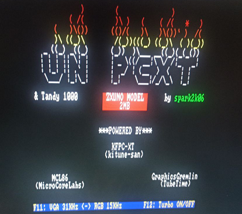

# [IBM PC/XT](https://en.wikipedia.org/wiki/IBM_Personal_Computer_XT) for [Xilinx Spartan 6](https://www.xilinx.com/products/silicon-devices/fpga/spartan-6.html)

PCXT port for Xilinx Spartan 6 Family FPGAs by [@spark2k06](https://github.com/spark2k06/).

## Description

The purpose of this core is to implement a PCXT as reliable as possible. For this purpose, the [MCL86 core](https://github.com/MicroCoreLabs/Projects/tree/master/MCL86) from [@MicroCoreLabs](https://github.com/MicroCoreLabs/) and [KFPC-XT](https://github.com/kitune-san/KFPC-XT) from [@kitune-san](https://github.com/kitune-san) are used.

The [Graphics Gremlin project](https://github.com/schlae/graphics-gremlin) from TubeTimeUS ([@schlae](https://github.com/schlae)) has also been integrated in this first stage.

[JTOPL](https://github.com/jotego/jtopl) by Jose Tejada (@topapate) was integrated for AdLib sound.

An SN76489AN Compatible Implementation (Tandy Sound) written in VHDL was also integrated - Copyright (c) 2005, 2006, [Arnim Laeuger](https://github.com/devsaurus) (arnim.laeuger@gmx.net)

## Models powered by Spartan 6
Family | Models | LEs | BRAM
-------- | ----------- | ----------- | -----------
XC6SLX9 | ZXUno, ZXUnCore | 9152 | 72 Kbytes
XC6SLX16 | ZXDos, NGo | 14579 | 72 Kbytes
XC6SLX25 | UnoXT, UnoXT2, ZXDos+ | 24051 | 117 KBytes

### PCXT default features according to model

Model | Memory | Audio | Tandy 1000 support | Binary
-------- | ----------- | ----------- | ----------- | ----------- 
ZXUno 512Kb | 512Kb | PC Speaker | No | [download](https://github.com/spark2k06/PCXT_Xilinx_Spartan_6/raw/main/releases/zxuno_512Kb/coreXX.zx1)
ZXUno 2Mb | 640Kb + 384Kb UMB + 1Mb EMS (Segment 0xC000) | PC Speaker + Tandy Sound | Yes | [download](https://github.com/spark2k06/PCXT_Xilinx_Spartan_6/raw/main/releases/zxuno_2Mb/coreXX.zx1)
ZXUno 2Mb Ext | 640Kb + 384Kb UMB + 1Mb EMS (Segment 0xC000) | PC Speaker + Tandy Sound | Yes | [download](https://github.com/spark2k06/PCXT_Xilinx_Spartan_6/raw/main/releases/zxuno_2Mb/coreXX.zx1)
ZXUno VGAWifi | 640Kb + 384Kb UMB + 1Mb EMS (Segment 0xC000) | PC Speaker + Tandy Sound | Yes | [download](https://github.com/spark2k06/PCXT_Xilinx_Spartan_6/raw/main/releases/vgawifi/coreXX.ZX1)
ZXUnCore 512Kb | 512Kb | PC Speaker | No | [download](https://github.com/spark2k06/PCXT_Xilinx_Spartan_6/raw/main/releases/zxuncore_512Kb/coreXX.zx1)
ZXUnCore 2Mb | 640Kb + 384Kb UMB + 1Mb EMS (Segment 0xC000) | PC Speaker + Tandy Sound | Yes | [download](https://github.com/spark2k06/PCXT_Xilinx_Spartan_6/raw/main/releases/zxuncore_2Mb_Ext/coreXX.zx1)
ZXDos 512Kb | 512Kb | PC Speaker + Adlib | No | [download](https://github.com/spark2k06/PCXT_Xilinx_Spartan_6/raw/main/releases/zxdos_512Kb/coreXX.zx2)
ZXDos 1Mb | 640Kb + 384Kb UMB | PC Speaker + Adlib + Tandy Sound | Yes | [folder](https://github.com/spark2k06/PCXT_Xilinx_Spartan_6/tree/main/releases/zxdos_1Mb)
NGo | 640Kb + 384Kb UMB + 1Mb EMS (Segment 0xC000) | PC Speaker + Adlib + Tandy Sound | Yes | [download](https://github.com/spark2k06/PCXT_Xilinx_Spartan_6/raw/main/releases/ngo/un_pcxt.bit)
ZXDos+ | 640Kb + 384Kb UMB + 1Mb EMS (Segment 0xC000) | PC Speaker + Adlib + Tandy Sound | Yes | [download](https://github.com/spark2k06/PCXT_Xilinx_Spartan_6/raw/main/releases/zxdosplus/coreXX.zxd)
UnoXT | 640Kb + 384Kb UMB + 1Mb EMS (Segment 0xC000) | PC Speaker + Adlib + Tandy Sound | Yes | [download](https://github.com/spark2k06/PCXT_Xilinx_Spartan_6/raw/main/releases/unoxt/coreXX.zxt)
UnoXT2 | 640Kb + 384Kb UMB + 1Mb EMS (Segment 0xC000) | PC Speaker + Adlib + Tandy Sound | Yes | [download](https://github.com/spark2k06/PCXT_Xilinx_Spartan_6/raw/main/releases/unoxt2/coreXX.xt2)

### PCXT common features

* Color Graphics Adapter (CGA)
* VGA/RGB output switch (F11)
* Turbo Mode ON/OFF (F12)
* XTIDE support
* Mouse support into COM1 serial port, this works like any Microsoft mouse... you just need a driver to configure it, like CTMOUSE 1.9 (available into hdd folder)

Note: On LX9 models, it is possible to remove the mouse and add Adlib, it would be necessary to resynthesise to get the binary, see Developers section.

## To-do list and challenges

* Joystick
* Improved timing to apply cycle-accurate

## Developers

The bitstream generation process has been automated. It is possible to generate and update the files in the release folder automatically by running the scripts in each folder. They only require the environment variable XILINX_BIN_PATH to be defined, with the path to the BIN folder where ISE has been installed.

Any contribution and pull request, please carry it out on the prerelease branch. Periodically they will be reviewed, moved and merged into the main branch, together with the corresponding release.

Thank you!
